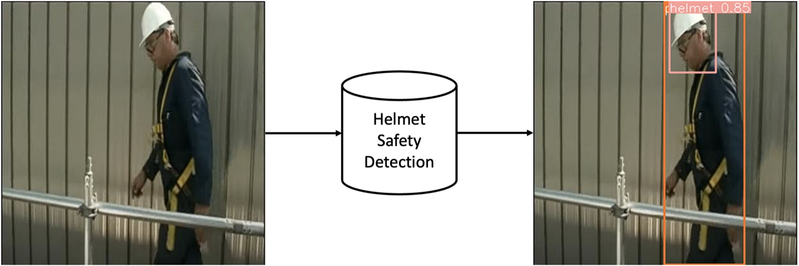
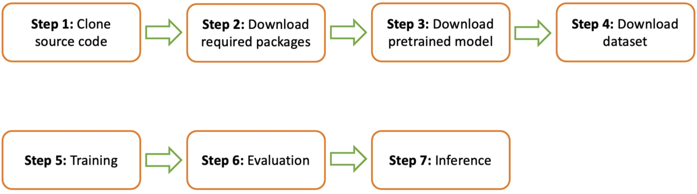
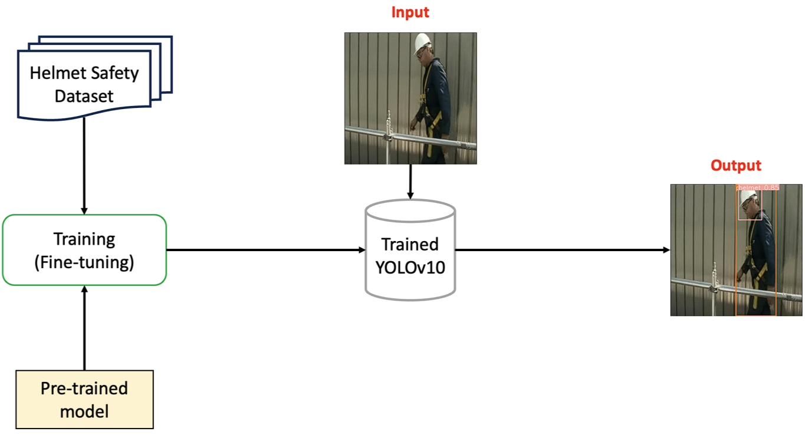
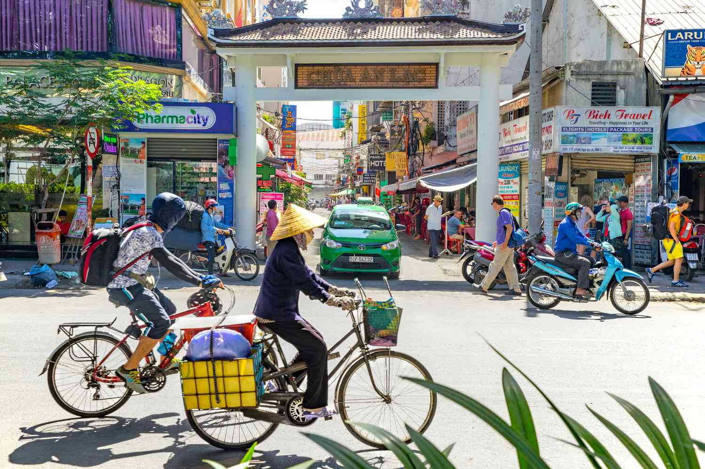
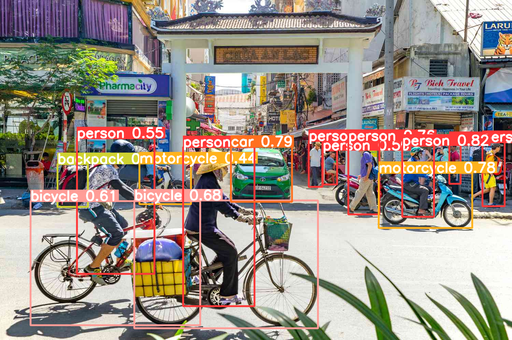
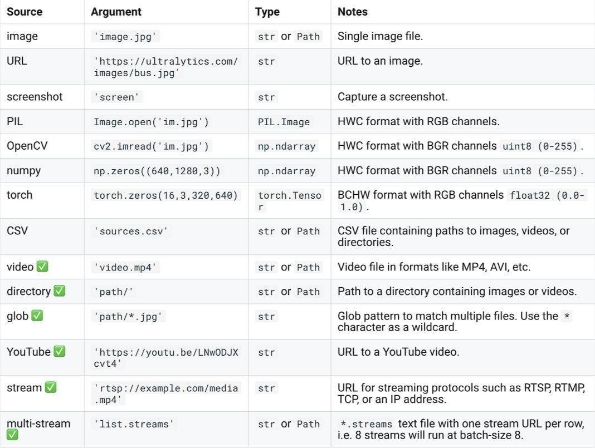
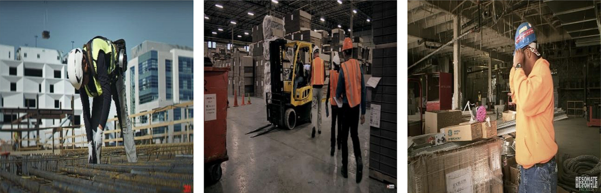

# Helmet-detection
Check helmet compliance with YOLOv10

## I. Giới thiệu
Object Detection (Tạm dịch: Phát hiện đối tượng) là một bài toán cổ điển thuộc lĩnh
vực Computer Vision. Mục tiêu của bài toán này là tự động xác định vị trí của các đối tượng
trong một tấm ảnh. Đây là một trong những bài toán quan trọng và phức tạp trong Computer
Vision, với ứng dụng rộng rãi từ nhận diện khuôn mặt, nhận dạng biển số xe, đến theo dõi đối
tượng trong video và tự động lái xe.



Trong project này, chúng ta sẽ xây dựng một chương trình phát hiện các nhân viên có đeo mũ
bảo vệ trong công trường hay không? Mô hình mà chúng ta sử dụng sẽ là mô hình YOLOv10.
Theo đó, Input và Output của chương trình là:
- Input: Một tấm ảnh.
- Output: Tọa độ (bounding box) của các nhân viên và phần mũ bảo hiểm.

Tổng quan, các bước thực hiện trong project của chúng để hoàn thiện hệ thống Helmet Safety
Detection bao gồm:




Luồng xử lý (pipeline) của chương trình Helmet Safety Detection mà chúng ta sẽ xây dựng có
dạng như sau:



## II. Cài đặt chương trình
Trong phần này, chúng ta sẽ tìm hiểu cách sử dụng YOLOv10 bao gồm việc sử dụng pre-trained
model và huấn luyện (fine-tuning) YOLOv10 trên bộ dữ liệu Helmet Safety Detection.

### 1. Cài đặt và sử dụng pre-trained model:
Một cách nhanh chóng để sử dụng được YOLOv10 đó là sử dụng pre-trained model (mô hình đã
được huấn luyện sẵn trên bộ dữ liệu COCO - một bộ dữ liệu rất lớn). Để sử dụng pre-trained
model, các bạn làm như sau:

#### 1.1. Tải mã nguồn YOLOv10 từ GitHub:
Để sử dụng YOLOv10, chúng ta cần tải mã nguồn (source code) của YOLOv10 về môi trường cài 
đặt code, mã nguồn của YOLOv10 được công khai trên GitHub. Như vậy, các bạn sẽ thực hiện 
theo các bước sau:
- Bước 1: Các bạn truy cập vào đường dẫn GitHub của YOLOv10 [tại đây](https://github.com/THU-MIG/yolov10).
- Bước 2: Tại trang GitHub của YOLOv10, các bạn chọn mục Code (có màu nền xanh
dương) và chọn nút copy đường dẫn sau đó clone YOLOv10 về bằng dòng lệnh sau:

    `git clone https://github.com/THU-MIG/yolov10.git`

#### 1.2. Cài đặt các thư viện cần thiết:
Mã nguồn YOLOv10 được xây dựng bằng rất nhiều
các thư viện Python khác nhau (các mã dưới đây được chạy dựa trên phiên bản python=3.9). 
Vì vậy, để có thể chạy được YOLOv10, ta cần tải các gói
thư viện cần thiết mà YOLOv10 yêu cầu bằng cách sử dụng file setup có sẵn trong mã
nguồn, các bạn có thể làm như sau:

```
cd yolov10
pip install -q -r requirements.txt
pip install -e .

cd ../
```
#### 1.3. Tải trọng số của pre-trained models: 
Các bạn tải file pretrained model tại [đây](https://github.com/THU-MIG/yolov10/releases/download/v1.1/yolov10n.pt) và đặt
file đã tải vào thư mục yolov10.

#### 1.4. Khởi tạo mô hình:
Để khởi tạo mô hình với trọng số vừa tải về, các bạn chạy đoạn code sau:
```
from ultralytics import YOLOv10

MODEL_PATH = 'yolov10/yolov10n.pt'
model = YOLOv10(MODEL_PATH)
```

#### 1.5. Tải ảnh cần dự đoán:
Chúng ta sẽ test mô hình trên một ảnh bất kì. Các bạn có thể tự chọn ảnh của riêng mình hoặc sử dụng ảnh tại [đây](https://www.tripsavvy.com/thmb/z1lmhJxYMQ6ScsISa3qHzeArsL0=/1500x0/filters:no_upscale():max_bytes(150000):strip_icc()/street-view-of-pham-ngu-lao-street--vietnam-921731936-5c353f9746e0fb000180251c.jpg).

Hãy tạo một thư mục images để lưu các ảnh, như tôi sẽ lưu ảnh trên với tên là HCMC_Street.png trong thư mục images.



#### 1.6. Dự đoán:
Để chạy dự đoán cho ảnh đã tải về, các bạn truyền đường dẫn ảnh vào mô hình như đoạn code sau:
```
IMG_PATH = 'images/HCMC_Street.jpg'
result = model(source=IMG_PATH)[0]
```

#### 1.7. Lưu kết quả dự đoán:
Để lưu lại ảnh đã được dự đoán, các bạn chạy đoạn code sau:

`result.save('images/HCMC_Street_predict.png')`



#### 1.8. Dự đoán youtube video:
Bên cạnh source về ảnh, các bạn cũng có thể input source với 
các tham số khác nhau, đại diện cho các dữ liệu đầu vòa khác nhau:



Ví dụ, để dự đoán với input là youtube video, các bạn chỉ cần thay thế IMG_PATH bằng đường dẫn youtube video như đoạn code sau:
```
YOUTUBE_VIDEO_PATH = 'https://youtu.be/wqPSsu7XQ74'
video_result = model(source=YOUTUBE_VIDEO_PATH)
```
Kết quả dự đoán sẽ là một video được lưu dưới dạng .avi trong thư mục: yolov10/runs/detect/predict

## III. Huấn luyện YOLOv10 trên tập dữ liệu mới
Trong phần này, chúng ta sẽ thực hiện huấn luyện mô hình YOLOv10 (fine-tuning) trên bộ dữ
liệu Helmet Safety Detection. Để tránh sự nhầm lẫn, phần này sẽ được thực hiện ở một file colab
khác so với phần trước. Các bước thực hiện như sau:

### 1. Tải bộ dữ liệu:
Chúng ta sẽ giải quyết bài toán phát hiện các công nhân. Bộ dữ liệu được
sử dụng trong bài toán này là Helmet Safety (link tải bộ dữ liệu tại [đây](https://drive.google.com/file/d/1twdtZEfcw4ghSZIiPDypJurZnNXzMO7R/view?usp=sharing)). Để dễ hình dung, các bạn có thể quan sát
ảnh minh họa sau:



Giải nén bộ dữ liệu vào folder datasets.

Bộ dữ liệu này đã được gán nhãn và đưa vào format cấu
trúc dữ liệu training theo yêu cầu của YOLO. Vì vậy, chúng ta sẽ không cần thực hiện
bước chuẩn bị dữ liệu ở bài này.
###  2. Cài đặt và import các thư viện cần thiết: 
Tương tự như phần trước.

###  3. Khởi tạo mô hình YOLOv10: 
Chúng ta sẽ khởi tạo mộ hình YOLOv10 với phiên
bản nano (n) từ trọng số đã được huấn luyện trên bộ dữ liệu COCO.
Các bạn tại về tại [đây](https://github.com/THU-MIG/yolov10/releases/download/v1.1/yolov10n.pt).

Để khởi tạo mô hình từ trọng số đã tải về, các bạn chạy đoạn code sau:

```
from ultralytics import YOLOv10

MODEL_PATH = 'yolov10n.pt'
model = YOLOv10(MODEL_PATH)
```

### 4. Huấn luyện mô hình: 
Chúng ta tiến hành huấn luyện YOLOv10 trên bộ dữ liệu Helmet
Safety Detection với 50 epochs và kích thước ảnh là 640. Các bạn chạy đoạn code sau:

```
YAML_PATH = '../safety_helmet_dataset/data.yaml'
EPOCHS = 50
IMG_SIZE = 640
BATCH_SIZE = 256

model.train(data=YAML_PATH, 
            epochs=EPOCHS, 
            batch=BATCH_SIZE, 
            imgsz=IMG_SIZE)
```

###  5. Đánh giá mô hình: 
Để thực hiện đánh giá mô hình trên tập test, các bạn chạy đoạn code sau:

```
TRAINED_MODEL_PATH = 'runs/detect/train/weights/best.pt'
model = YOLOv10(TRAINED_MODEL_PATH)

model.val(data=YAML_PATH,
          imgsz=IMG_SIZE, 
          split='test')
```
